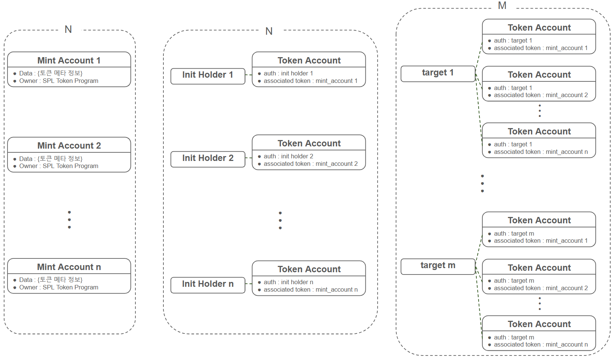

# Solana Go Client

Solana 성능 테스트용 Go Client 입니다.

SPL Token의 동작을 요청합니다.

## 주요 API

### 테스트 시나리오 API

| 시나리오 |               url               |             parameter              |
| :------: | :-----------------------------: | :--------------------------------: |
|  deploy  | `[post] /spl/deploy-with-mint ` | `[json] { amount : ${int_value} }` |
| minting  |       `[post] /spl/mint `       | `[json] { amount : ${int_value} }` |
| transfer |     `[post] /spl/transfer `     | `[json] { amount : ${int_value} }` |
|  query   |       `[get] /spl/query `       |                                    |

- deploy : 초기 init_holder N명이 돌아가면서 신규 token 발행
- minting : 초기 배포된 token N개를 돌아가면서 target M명에게 추가 minting
- transfer : 초기 init_holder N명이 돌아가면서 target M명에게 전송
- query : init_holder N명이 들고있는 토큰의 balance 조회

### 보조 API

|  시나리오  |              url               |                          parameter                           |
| :--------: | :----------------------------: | :----------------------------------------------------------: |
|  SOL 확인  |   `[post] /account/balance `   |           `[json] { owner_address : ${address} }`            |
|  SOL 충전  | `[post] /account/fill-balance` |             `[json] { amount : ${sol_amount} }`              |
| token 확인 |  `[post] /spl/target/query `   | `[json] { mint_address:${address},owner_address:${address} }` |

- SOL 충전: 서버 실행 시 지갑을 생성하며 10 SOL 만큼씩 충전해 두지만, 테스트 과정에서 SOL이 부족해지면 수행

### 초기화 API

|       시나리오       |               url               |               parameter               |
| :------------------: | :-----------------------------: | :-----------------------------------: |
| mint account 초기화  | `[post] /spl/set-mint-account`  | `[json] { amount : ${token_amount} }` |
| token account 초기화 | `[post] /spl/set-token-account` |                                       |

- client 서버가 실행될 때 자동으로 호출

## account 세팅 방식

### SPL token program 동작 시, 사용 account 종류

- payer AC
  - transaction 비용 내는 계정
- funding AC
  - mint account가 유지되는 비용을 내는 계정
- freeze auth AC
  - 해당 토큰에 대한 Lock 권한을 가진 계정
- mint auth AC
  - 해당 토큰의 minting 권한을 가진 계정
- mint AC
  - 토큰에 대한 전체적인 정보가 담긴 계정
  - token itself
- user AC
  - 일반 solana 계정
  - 여기서는 최초 minting의 대상이 될 `init_holder`와 trasnfer의 대상이 될 `target`으로 나누어 사용
- token AC (= ata)
  - user AC가 들고 있는 토큰의 양이 저장되는 계정
  - 주로 ata(Associated Token Address) 계정으로 사용

### account 명칭 정의

- Mint Account
  - 토큰 프로그램을 배포할 때 생성하는 account로, 하나의 토큰을 의미하는 account
  - 설정 파일로 사용할 Mint Account의 개수 N을 지정
- Init Holder
  - Mint Account와 1:1로 매핑하여 생성할 account
  - Init Holder의 token account는 최초 minting 대상
  - Mint Account에 대한 모든 권한과 비용 지불을 담당
  - 설정 파일로 사용할 Init Holder의 개수 N을 지정
- Target
  - Init Holder로부터 token을 transfer 받을 대상 account
  - 각각의 Target은 N개의 모든 Token에 대한 token account가 필요
  - 설정정 파일로 사용할 Init Holder의 개수 M을 지정

### account 설정 방안

- init_holder

   = payer = funding = freezeAuth = mintAuth

- 최초 minting의 될 init_holder가 token에 대한 모든 지불 및 권한 수행

## 주요 오류 케이스

### IllegalOwner

- 동일 account에 중첩된 접근으로 오류 발생 확인

- 발생 케이스
  - 생성된 token account에 대해서 또 다시 생성 요청 시 `Provided owner is not allowed`에러 발생 확인
  - token account의 생성이 늦어서, account info 확인 시 null이었다가 직후 생성되어 중복된 요청 전송으로 확인됨

- 해결
  - client 서버 기동 시, token account 사전에 미리 세팅

### Attempt to debit an account but found no record of a prior credit

- 잔고 부족 오류
- 발생 케이스
  - airdrop 실패 : 너무 많은 airdrop 요청 시 진행 X => 계정당 10 SOL 씩만 airdrop
  - N: 1인 상태에서 `deploy-and-mint` 수행 시 발생
- 해결: `/account/fill-balance` 수행 필요

## 회고

테스트 시작 전부터 테스트 케이스에 대한 정의를 명확하게 하고 진행하는 것이 필요함을 다시 느끼게 되었다.

노드 파라미터를 초기부터 변경하고 시작하여, 디폴트와의 차이를 보기위해 파라미터를 수정하는 과정에서 했던 작업을 반복하는 경우가 있었다. 이런 반복적인 작업을 없애기 위해서라도 초기 설계가 매우 중요할 것이다.

또한, 테스트 과정에서 서버 파일을 넣는 것에도 시간이 소요되어, 해당 작업을 고려하여 미리 서버 api를 뚫어두던지, 옮기는 과정을 원활하게 하는 환경 세팅을 해두었으면, 조금 더 원할한 테스트가 되었을 것이다.
